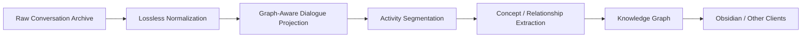

# NeuralMap / Provenance

[](https://github.com/makebashangwe/neuralmap-provenance-demo/actions/workflows/tests.yml)

**Privacy-safe public demo of a provenance-preserving conversational knowledge pipeline.**

NeuralMap / Provenance is a local-first system for reconstructing long-form AI conversation history into structured dialogue, semantic activity segments, and eventually a longitudinal knowledge graph.

The production project remains private because it processes personal conversation history. This repository uses **synthetic data only** and demonstrates the architecture without exposing private source material.

---

## Why I Built It

A ChatGPT export is not a knowledge graph.

A single conversation may contain multiple unrelated activities, temporary asides, resumed topics, regenerated answers, alternate conversation branches, attachments and metadata, and ideas that reappear months later.

Simply converting each chat into one Markdown file would preserve a **storage boundary**, not a meaningful knowledge boundary.

NeuralMap separates:

1. **source truth**
2. **conversation structure**
3. **semantic activity**
4. **derived knowledge**

---

## Architecture



### Layer 1: Lossless Normalization

The source archive is converted into stable internal records such as:

- conversations
- nodes
- messages
- text spans
- attachments

The goal is to reorganize the data without destroying source information.

### Layer 2: Graph-Aware Dialogue Projection

ChatGPT conversations are not always linear transcripts. Regenerated responses and alternate branches create tree-like conversation structures.

NeuralMap preserves explicit parent/child relationships instead of reconstructing history from timestamps alone.

### Layer 3: Activity Segmentation

The semantic layer asks:

> **What activity is the user doing, and when did that activity actually change?**

That is intentionally different from extracting every concept mentioned in the text.

```text
Activity:
Building Viridian backend

Concepts:
FastAPI
PostgreSQL
JWT
authentication
database migrations
```

### Layer 4: Knowledge Graph

Later stages can derive relationships such as:

```text
Viridian --uses--> PostgreSQL
Viridian --uses--> FastAPI
Authentication --implemented_with--> JWT
```

Derived records remain linked to their original evidence.

---

## Core Design Principle

> **Preserve source truth. Layer interpretation on top. Keep a path back to the evidence.**

Source records are never overwritten with inferred meaning.

```text
knowledge relationship
        ↓
semantic segment
        ↓
exchange unit
        ↓
message
        ↓
text span
        ↓
original source
```

This keeps semantic output auditable and replaceable without rewriting history.

---

## Production-Scale Validation

The private NeuralMap system has processed and validated:

| Artifact | Scale |
|---|---:|
| Dialogue records | 72K+ |
| Exchange units | 37K+ |
| Graph edges | 84K+ |
| Conversation manifests | 3.9K+ |
| Source nodes | 88K+ |

The production pipeline also includes:

- deterministic repeat-run validation
- graph-integrity checks
- SHA-256 artifact manifests
- incremental snapshot ingestion
- stable canonical identities
- conversation-disjoint evaluation datasets
- frozen model/policy evaluation
- precision / recall / F1 quality gates

---

## Evaluation Philosophy

A model producing output does not mean the output is good enough to ship.

One frozen segmentation candidate achieved:

| Metric | Result |
|---|---:|
| Precision | 0.750 |
| Recall | 0.286 |
| F1 | 0.414 |
| True Positives | 6 |
| False Positives | 2 |
| False Negatives | 15 |

The candidate was **rejected** because it missed too many real activity shifts.

That result is intentionally documented. The evaluation system exists to prevent unreliable semantic structure from contaminating the downstream knowledge graph.

---

## What This Public Demo Includes

The synthetic archive demonstrates:

- conversation trees
- regenerated assistant responses
- selected conversation paths
- temporary asides
- explicit topic resumption
- genuine activity shifts
- provenance-preserving text spans
- deterministic outputs

The demo produces:

```text
out/
├── normalized_conversations.jsonl
├── normalized_nodes.jsonl
├── normalized_messages.jsonl
├── text_spans.jsonl
├── graph_edges.jsonl
├── exchange_units.jsonl
├── semantic_boundaries.jsonl
└── demo-report.md
```

---

## Run the Demo

### Requirements

- Python 3.11+

Clone and install:

```bash
git clone https://github.com/makebashangwe/neuralmap-provenance-demo.git
cd neuralmap-provenance-demo
python -m pip install -e .
```

Run the demo:

```bash
neuralmap-demo
```

Run the tests:

```bash
python -m unittest discover -s tests -v
```

The public demo tests:

- branch preservation
- regenerated-response path selection
- exact text-span preservation
- conversation-safe node identity
- expected semantic boundary sequence
- deterministic repeat-run output

---

## Repository Structure

```text
neuralmap-provenance-demo/
├── data/
│   └── synthetic_archive.json
├── docs/
│   ├── ARCHITECTURE.md
│   └── EVALUATION.md
├── src/
│   └── neuralmap_demo/
│       ├── __init__.py
│       ├── pipeline.py
│       └── cli.py
├── tests/
│   └── test_pipeline.py
├── .github/
│   └── workflows/
│       └── tests.yml
├── .gitignore
├── pyproject.toml
└── README.md
```

---

## What Is Intentionally Private

The production repository is not public because it processes personal longitudinal data.

This demo does **not** contain:

- real conversation history
- personal text excerpts
- private evaluation labels
- production model artifacts
- private local paths
- API credentials
- production incremental-ingestion state
- final Obsidian knowledge output

This repository exists to demonstrate the **engineering architecture**, not expose the underlying personal dataset.

---

## Current Status

The public demo covers:

```text
source archive
    ↓
normalization
    ↓
conversation graph
    ↓
dialogue exchanges
    ↓
illustrative activity boundaries
```

The private project continues toward:

```text
semantic segmentation
    ↓
concept extraction
    ↓
relationship construction
    ↓
longitudinal knowledge graph
    ↓
Obsidian / other interfaces
```

---

## Engineering Themes

- data provenance
- graph-aware data modeling
- deterministic pipelines
- semantic segmentation
- evaluation design
- privacy-preserving architecture
- incremental ingestion
- longitudinal context systems
- knowledge graphs
- AI-assisted systems engineering

---

## Author

**Makeba Waddy**

Computer Science student and cloud / AI systems engineer building toward intelligent systems, AI infrastructure, and production software engineering.


## License

Copyright © 2026 Makeba Waddy. All rights reserved.

This repository is publicly available for portfolio review and technical
evaluation. No license is granted to copy, modify, distribute, sublicense,
or commercially use the source code.
